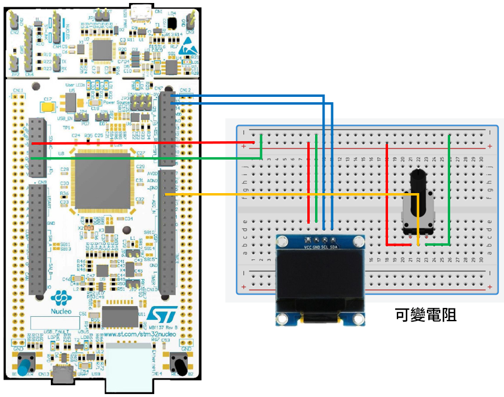

# STM32 Project - 類比轉數位轉換器

這是一個用於 STM32F4 系列微控制器的示例項目，旨在讀取可變電阻的電壓。

## 硬件要求

- STM32F429ZIT6 微控制器
- OLED 0.96 I2C
- 可變電阻

## 軟件依賴

- STM32CubeIDE

## 學習目標

- 使用 stm32 ADC，讀取數值

## 電路圖

## 構建和編譯

1. 將資料夾放入 STM32CubeIDE 的 WorkSpace 中
2. 在 STM32CubeIDE 中打開 .cproject
3. 編譯並燒寫至您的微控制器

## 使用方法

將編譯好的程序燒寫到 STM32 微控制器後，旋轉可變電阻。
OLED 上行顯示原始數據，下行顯示電壓 (依原始數據轉換)
